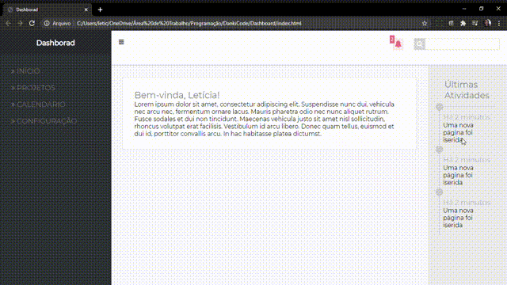

O Dashboard foi desenvolvido com o objetivo de demostrar minha evolução nos estudos.

### Características
- HTML
- Css

### Instalação 

Clone este repositório usando git clone https://github.com/Leticiafrnc/Dashboard.git ou clique em Code/Download ZIP.
Clique no arquivo "index.HTML" e veja a aplicação.

### Observação: Se abrir a aplicação no celular, tablet ou qualquer tipo de tela a aplicação se adapta.
